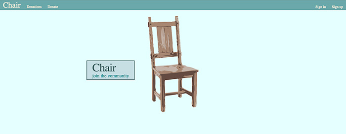

##Chair

###Description
A community app for donating and locating free furniture.

###Heroku link
[https://chair-app.herokuapp.com/](https://chair-app.herokuapp.com/)

###Gems
* 	devise
* 	paperclip
* 	sass-rails
* 	bootstrap-sass
* 	bcrypt-ruby
* 	geocoder
* 	pg

###Languages
* 	Ruby
* 	HTML5
* 	CSS

###Technologies
* 	Rails v 4.1.0
* 	Ruby v 2.0.0
* 	Postgres
* 	Amazon S3
* 	Google API
* 	Devise Authentication

####Screenshot
